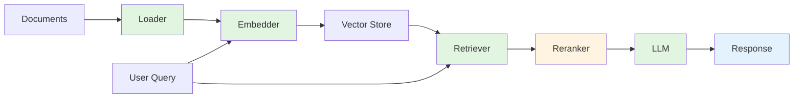

# rag-pipeline-utils

**Modular toolkit for building production-ready RAG pipelines in Node.js**

[](https://github.com/DevilsDev/rag-pipeline-utils/actions)
[](https://www.npmjs.com/package/@devilsdev/rag-pipeline-utils)
[](https://codecov.io/gh/DevilsDev/rag-pipeline-utils)
[](https://opensource.org/licenses/GPL-3.0)
[](https://nodejs.org/)
[](https://www.npmjs.com/package/@devilsdev/rag-pipeline-utils)
[](https://github.com/DevilsDev/rag-pipeline-utils/discussions)

---

## Why This Exists

Building Retrieval-Augmented Generation (RAG) systems is harder than it should be. Most solutions lock you into specific vendors, force opinionated architectures, or sacrifice observability for simplicity.

**rag-pipeline-utils** takes a different approach: it provides the building blocks—loaders, embedders, retrievers, LLM connectors, and rerankers—that you compose into pipelines that fit your needs. Every component follows clear contracts. Every integration is optional. Every decision is yours.

We built this toolkit because we believe infrastructure should be:

- **Modular** – swap any component without rewriting your pipeline
- **Observable** – metrics, tracing, and audit logs built in from day one
- **Secure** – hardened JWT validation with replay protection, multi-layer path traversal defense, and enterprise-grade defaults
- **Open** – no vendor lock-in, no proprietary APIs, just JavaScript

Whether you're prototyping a document Q&A system or scaling a production knowledge base, this toolkit grows with you.

---

## Quick Start

Here's a complete RAG pipeline in 15 lines:

```javascript
const { createRagPipeline } = require("@devilsdev/rag-pipeline-utils");

// Implement your plugins (or use existing ones)
const pipeline = createRagPipeline({
  loader: new MyPDFLoader(),
  embedder: new MyOpenAIEmbedder({ apiKey: process.env.OPENAI_API_KEY }),
  retriever: new MyVectorDBRetriever({ url: "http://localhost:8000" }),
  llm: new MyLLMConnector({ model: "gpt-4" }),
});

// Ingest documents
await pipeline.ingest("./company-docs.pdf");

// Query with natural language
const answer = await pipeline.query("What is the vacation policy?");
console.log(answer.text);
// Output: "Based on the company handbook, employees receive 20 days of vacation per year..."
```

**Requirements:** Node.js >= 18.0.0

Install with:

```bash
npm install @devilsdev/rag-pipeline-utils
```

### What's New in v2.3.0 (Released November 7, 2025)

**Major Security Enhancements:**

- **Advanced JWT replay protection** with self-signed token reusability
- **Hardened path traversal defense** with iterative URL decoding
- **Consistent validation behavior** eliminating duplicate checks
- **Race condition mitigation** in concurrent token verification

**All security tests passing:** 113 security-focused tests with 100% coverage on critical paths.

[See full security details below](#security-and-quality) | [Migration guide](#upgrading-from-v22x)

---

## How It Works

**rag-pipeline-utils** orchestrates data through a clear, predictable flow:



1. **Loader** – Parse documents (PDF, HTML, Markdown, etc.)
2. **Embedder** – Convert text to vector embeddings
3. **Vector Store** – Index and persist embeddings
4. **Retriever** – Find semantically similar content
5. **Reranker** (optional) – Refine retrieval results
6. **LLM** – Generate contextual responses

Every component is replaceable. Every step is observable.

---

## Features

### Modular Plugin Architecture

Swap any component without rewriting your pipeline. Use OpenAI embeddings with Pinecone storage, or mix Hugging Face models with PostgreSQL—your choice.

### Enterprise Observability

Built-in structured logging, Prometheus metrics, OpenTelemetry tracing, and audit logs for compliance-grade transparency.

### DAG Workflow Engine

Chain complex multi-step operations with retry logic, parallel execution, and graceful error handling. Perfect for batch ingestion or multi-stage transformations.

### Type-Safe Contracts

Complete TypeScript interfaces for all plugin types. Full IDE autocomplete and compile-time validation.

### Production-Ready Security

Hardened security with defense-in-depth: JWT replay protection with race condition mitigation, multi-layer path traversal defense with iterative URL decoding, validated JSON parsing, algorithm whitelisting, automatic secret redaction, and comprehensive audit logging.

### Streaming & Batching

Stream LLM responses in real-time. Batch embed thousands of documents efficiently with parallel processing and backpressure control.

### Framework Agnostic

Works with Express, Fastify, Next.js, or any Node.js runtime. Deploy to AWS Lambda, Vercel, Docker, or bare metal.

---

## Join the Community

We're building this together.

Whether you're implementing a new retriever, writing documentation, reporting bugs, or sharing ideas—every contribution makes this toolkit better for everyone.

**Getting Started:**

- [GitHub Discussions](https://github.com/DevilsDev/rag-pipeline-utils/discussions) – Ask questions, share use cases, propose features
- [Issue Tracker](https://github.com/DevilsDev/rag-pipeline-utils/issues) – Report bugs or request features
- [Contributing Guide](https://github.com/DevilsDev/rag-pipeline-utils/blob/main/docs/CONTRIBUTING.md) – Learn how to submit pull requests
- [Code of Conduct](https://github.com/DevilsDev/rag-pipeline-utils/blob/main/CODE_OF_CONDUCT.md) – Our community standards

**Good First Issues:** Look for issues tagged `good first issue` to find beginner-friendly contributions.

**Office Hours:** Join our monthly community calls to discuss roadmap priorities and architectural decisions.

---

## Security and Quality

Security isn't optional. This toolkit is built with defense in depth:

### Core Security Features

- **Validated Inputs** – All JSON parsed through schema validation (AJV)
- **Secure Logging** – Automatic redaction of 36 sensitive field patterns (API keys, JWTs, tokens)
- **JWT Best Practices** – Algorithm whitelisting, issuer/audience validation, expiration enforcement
- **Dependency Scanning** – Weekly Dependabot updates, CI blocks on critical vulnerabilities
- **Audit Trail** – Immutable compliance-grade logs for all security-sensitive operations
- **Plugin Sandboxing** – Third-party plugins run with declared permissions and resource limits
- **Supply Chain Security** – All GitHub Actions pinned to commit SHAs, SBOM generation available

### Recent Security Enhancements (v2.3.0)

#### Hardened JWT Validation

**Advanced Replay Protection:**

- Self-signed tokens can be verified multiple times (essential for refresh flows and load balancer retries)
- External tokens are tracked and blocked on replay attempts
- Race condition mitigation with optimized check-then-set pattern
- Separate tracking for reusable vs. single-use tokens

**Consistent Validation Behavior:**

- `strictValidation` flag now consistently controls issuer/audience validation
- Eliminated duplicate validation logic to prevent configuration confusion
- Clear separation of concerns: jsonwebtoken handles cryptographic validation, custom logic handles business rules

**Example:**

```javascript
const { JWTValidator } = require("@devilsdev/rag-pipeline-utils");

const validator = new JWTValidator({
  secret: process.env.JWT_SECRET,
  algorithm: "HS256",
  issuer: "my-app",
  audience: "api-users",
  strictValidation: true, // Enforces iss/aud validation
  enableJtiTracking: true, // Prevents replay attacks
});

// Self-signed tokens can be verified multiple times
const token = validator.sign({ sub: "user-123" });
validator.verify(token); // First verification
validator.verify(token); // Still works (refresh flow)

// External tokens are blocked on replay
const externalToken = getTokenFromThirdParty();
validator.verify(externalToken); // First use
validator.verify(externalToken); // Throws "Token replay detected"
```

#### Path Traversal Defense

**Multi-Layer Protection:**

- Iterative URL decoding (up to 5 passes) to catch sophisticated encoding attacks
- Detects double-encoded paths: `%252e%252e%252f` → `%2e%2e%2f` → `../`
- Malformed encoding treated as attack indicator (throws error)
- Critical security violations always throw, regardless of configuration

**Attack Vectors Blocked:**

- Standard traversal: `../../../etc/passwd`
- Windows paths: `..\..\windows\system32`
- URL encoded: `%2e%2e%2f`, `%2e%2e%5c`
- Double encoded: `%252e%252e%252f`
- Mixed encoding: combinations of above

**Example:**

```javascript
const { sanitizePath } = require("@devilsdev/rag-pipeline-utils");

// Safe paths are normalized
sanitizePath("docs/README.md"); // Returns: "docs/README.md"

// Dangerous paths throw errors
sanitizePath("../../../etc/passwd"); // Throws
sanitizePath("%2e%2e%2f%2e%2e%2fpasswd"); // Throws
sanitizePath("%252e%252e%252fconfig"); // Throws (double-encoded)
```

#### Defense-in-Depth Architecture

**Critical Security Errors:**

- Path traversal violations **always throw**, even if `throwOnInvalid=false`
- Object depth limit violations **always throw** to prevent DoS
- Security-critical operations are prioritized over configuration flexibility

**Security Monitoring:**

- All blocked attempts tracked in `stats.blocked` counter
- Audit events emitted for replay detection, algorithm mismatches, and validation failures
- Structured logging with security event correlation

### Quality Metrics

**Zero Production Vulnerabilities:** `npm audit --production` returns clean on every release.

**Test Coverage:** 113 security-focused tests across 2 dedicated security suites:

- JWT Validator: 44 tests covering algorithm confusion, replay attacks, and validation edge cases
- Input Sanitizer: 69 tests covering XSS, SQL injection, command injection, and path traversal

**Supported Node Versions:** 18.x, 20.x, 22.x (tested in CI)

---

## Installation & Development

### Install

```bash
npm install @devilsdev/rag-pipeline-utils
```

### Development Setup

```bash
# Clone the repository
git clone https://github.com/DevilsDev/rag-pipeline-utils.git
cd rag-pipeline-utils

# Install dependencies
npm install

# Run tests
npm test

# Run linter
npm run lint

# Build distribution
npm run build

# Run development tools
npm run dev
```

### Common Commands

```bash
npm test                # Run test suite
npm run test:watch      # Watch mode for TDD
npm run lint            # Check code style
npm run lint:fix        # Auto-fix linting issues
npm run security:audit  # Scan dependencies
npm run docs:api        # Generate API documentation
npm run benchmark       # Performance benchmarks
```

---

## Roadmap

### v2.3.0 (Released November 7, 2025) ✅

- ✅ **Enhanced CLI** – Interactive wizard for pipeline setup, validation commands, and migration tools
- ✅ **Plugin Marketplace** – Curated registry of community-contributed plugins with ratings and verification
- ✅ **Multi-Tenant Support** – Workspace isolation, resource quotas, and tenant-specific configurations
- ✅ **Advanced Security** – JWT replay protection and hardened path traversal defense

### v2.4.0 (Q1 2026)

- **Streaming Embeddings** – Real-time embedding generation with backpressure control
- **GraphRAG Support** – Native knowledge graph integration for entity-relationship retrieval
- **Advanced Reranking** – Cross-encoder models and learned ranking functions
- **Performance Dashboard** – Web UI for monitoring pipeline health and cost metrics

### v2.5.0 (Q2 2026)

- **Federated Learning** – Privacy-preserving model training across distributed datasets
- **Advanced Caching** – Intelligent embedding cache with TTL and invalidation strategies
- **Multi-Modal Processing** – Native image and audio embedding support
- **Cost Optimization** – Automatic provider selection based on cost and performance

### Beyond 2026

- Native Rust bindings for performance-critical paths
- Kubernetes operator for production deployments
- Real-time collaboration features for team-based pipelines
- Edge deployment support for latency-sensitive applications

**Vote on features:** Share your priorities in [GitHub Discussions](https://github.com/DevilsDev/rag-pipeline-utils/discussions/categories/roadmap).

---

## Upgrading from v2.2.x

The v2.3.0 release includes important security enhancements that are **100% backward compatible** for most use cases. However, there are a few behavioral changes to be aware of:

### JWT Validator Changes

#### No Action Required (Recommended Use Case)

If you're using the default configuration with `strictValidation: true` (the default), everything works the same:

```javascript
const validator = new JWTValidator({
  secret: process.env.JWT_SECRET,
  algorithm: "HS256",
  issuer: "my-app",
  audience: "api-users",
  // strictValidation defaults to true
});

// Behavior unchanged - tokens validated correctly
```

#### Behavior Change (Advanced Use Case)

If you explicitly set `strictValidation: false`, the behavior has changed for consistency:

**Before v2.3.0:**

```javascript
const validator = new JWTValidator({
  secret: process.env.JWT_SECRET,
  strictValidation: false,
  issuer: "my-app", // These were still validated
  audience: "api-users", // even with strictValidation=false
});
```

**After v2.3.0:**

```javascript
const validator = new JWTValidator({
  secret: process.env.JWT_SECRET,
  strictValidation: false,
  issuer: "my-app", // Now properly ignored
  audience: "api-users", // when strictValidation=false
});
// issuer/audience validation is now truly disabled
```

**Migration:** If you were relying on the old inconsistent behavior, set `strictValidation: true` explicitly.

#### Enhanced Behavior (Self-Signed Tokens)

Self-signed tokens can now be verified multiple times, which is essential for:

- Refresh token flows
- Load balancer retries
- Distributed systems with eventual consistency

```javascript
const token = validator.sign({ sub: "user-123" });

// Before v2.3.0: Second verification would throw "replay detected"
// After v2.3.0: Works correctly for self-signed tokens
validator.verify(token); // Works
validator.verify(token); // Now works!
```

External tokens (not signed by your validator) are still correctly blocked on replay.

### Input Sanitizer Changes

#### Path Traversal Now Always Throws

Path traversal attempts now **always throw errors**, even with `throwOnInvalid: false`:

**Before v2.3.0:**

```javascript
const sanitizer = new InputSanitizer({ throwOnInvalid: false });
const result = sanitizePath("../../../etc/passwd");
// Returned: null (silent failure)
```

**After v2.3.0:**

```javascript
const sanitizer = new InputSanitizer({ throwOnInvalid: false });
const result = sanitizePath("../../../etc/passwd");
// Throws: "Potential path traversal detected"
```

**Rationale:** Path traversal is a critical security violation that should never be silently ignored.

**Migration:** Wrap path sanitization in try-catch if you need to handle errors gracefully:

```javascript
try {
  const safePath = sanitizePath(userInput);
  // Use safePath
} catch (error) {
  if (error.message.includes("path traversal")) {
    // Handle attack attempt
    logger.warn("Path traversal blocked", { input: userInput });
    return res.status(400).json({ error: "Invalid path" });
  }
  throw error;
}
```

### Breaking Changes

**None.** All changes are security enhancements that improve correctness without breaking existing valid use cases.

### Testing Your Upgrade

Run your test suite after upgrading:

```bash
npm test
```

If you encounter issues, please [open an issue](https://github.com/DevilsDev/rag-pipeline-utils/issues) with details about your configuration.

---

## Contributing

We welcome contributions of all kinds:

- **Code** – Fix bugs, add features, improve performance
- **Documentation** – Write guides, improve examples, clarify concepts
- **Testing** – Expand test coverage, add integration tests, report edge cases
- **Design** – Propose API improvements, suggest architectural patterns
- **Community** – Answer questions, review pull requests, mentor new contributors

**Before You Start:**

1. Read the [Contributing Guide](https://github.com/DevilsDev/rag-pipeline-utils/blob/main/docs/CONTRIBUTING.md)
2. Check existing [Issues](https://github.com/DevilsDev/rag-pipeline-utils/issues) and [Discussions](https://github.com/DevilsDev/rag-pipeline-utils/discussions)
3. Open an issue to discuss major changes before coding
4. Follow our [Code of Conduct](https://github.com/DevilsDev/rag-pipeline-utils/blob/main/CODE_OF_CONDUCT.md)

**Pull Request Checklist:**

- [ ] Tests pass (`npm test`)
- [ ] Linter passes (`npm run lint`)
- [ ] Documentation updated
- [ ] Changelog entry added
- [ ] Type definitions updated (if applicable)

---

## License

**GPL-3.0** – See [LICENSE](https://github.com/DevilsDev/rag-pipeline-utils/blob/main/LICENSE) for full terms.

This is free software: you are free to change and redistribute it under the terms of the GNU General Public License version 3.

---

## What's Next?

**Star this repository** if you find it useful—it helps others discover the project.

**Share your use case** in [Discussions](https://github.com/DevilsDev/rag-pipeline-utils/discussions/categories/show-and-tell) to inspire the community.

**Contribute** your first pull request—check out issues tagged [good first issue](https://github.com/DevilsDev/rag-pipeline-utils/labels/good%20first%20issue).

Happy building.
