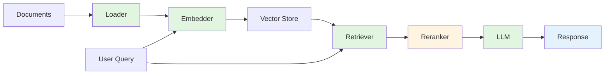

# rag-pipeline-utils

**Modular toolkit for building production-ready RAG pipelines in Node.js**

[](https://github.com/DevilsDev/rag-pipeline-utils/actions)
[](https://www.npmjs.com/package/@devilsdev/rag-pipeline-utils)
[](https://codecov.io/gh/DevilsDev/rag-pipeline-utils)
[](https://opensource.org/licenses/GPL-3.0)
[](https://nodejs.org/)
[](https://www.npmjs.com/package/@devilsdev/rag-pipeline-utils)
[](https://github.com/DevilsDev/rag-pipeline-utils/discussions)

---

## Why This Exists

Building Retrieval-Augmented Generation (RAG) systems is harder than it should be. Most solutions lock you into specific vendors, force opinionated architectures, or sacrifice observability for simplicity.

**rag-pipeline-utils** takes a different approach: it provides the building blocks—loaders, embedders, retrievers, LLM connectors, and rerankers—that you compose into pipelines that fit your needs. Every component follows clear contracts. Every integration is optional. Every decision is yours.

We built this toolkit because we believe infrastructure should be:

- **Modular** – swap any component without rewriting your pipeline
- **Observable** – metrics, tracing, and audit logs built in from day one
- **Secure** – enterprise-grade defaults, validated inputs, safe JWT handling
- **Open** – no vendor lock-in, no proprietary APIs, just JavaScript

Whether you're prototyping a document Q&A system or scaling a production knowledge base, this toolkit grows with you.

---

## Quick Start

Here's a complete RAG pipeline in 15 lines:

```javascript
const { createRagPipeline } = require("@devilsdev/rag-pipeline-utils");

// Implement your plugins (or use existing ones)
const pipeline = createRagPipeline({
  loader: new MyPDFLoader(),
  embedder: new MyOpenAIEmbedder({ apiKey: process.env.OPENAI_API_KEY }),
  retriever: new MyVectorDBRetriever({ url: "http://localhost:8000" }),
  llm: new MyLLMConnector({ model: "gpt-4" }),
});

// Ingest documents
await pipeline.ingest("./company-docs.pdf");

// Query with natural language
const answer = await pipeline.query("What is the vacation policy?");
console.log(answer.text);
// Output: "Based on the company handbook, employees receive 20 days of vacation per year..."
```

**Requirements:** Node.js >= 18.0.0

Install with:

```bash
npm install @devilsdev/rag-pipeline-utils
```

---

## How It Works

**rag-pipeline-utils** orchestrates data through a clear, predictable flow:



1. **Loader** – Parse documents (PDF, HTML, Markdown, etc.)
2. **Embedder** – Convert text to vector embeddings
3. **Vector Store** – Index and persist embeddings
4. **Retriever** – Find semantically similar content
5. **Reranker** (optional) – Refine retrieval results
6. **LLM** – Generate contextual responses

Every component is replaceable. Every step is observable.

---

## Features

### Modular Plugin Architecture

Swap any component without rewriting your pipeline. Use OpenAI embeddings with Pinecone storage, or mix Hugging Face models with PostgreSQL—your choice.

### Enterprise Observability

Built-in structured logging, Prometheus metrics, OpenTelemetry tracing, and audit logs for compliance-grade transparency.

### DAG Workflow Engine

Chain complex multi-step operations with retry logic, parallel execution, and graceful error handling. Perfect for batch ingestion or multi-stage transformations.

### Type-Safe Contracts

Complete TypeScript interfaces for all plugin types. Full IDE autocomplete and compile-time validation.

### Production-Ready Security

Secure defaults everywhere: validated JSON parsing, JWT algorithm whitelisting, automatic secret redaction in logs, and dependency scanning.

### Streaming & Batching

Stream LLM responses in real-time. Batch embed thousands of documents efficiently with parallel processing and backpressure control.

### Framework Agnostic

Works with Express, Fastify, Next.js, or any Node.js runtime. Deploy to AWS Lambda, Vercel, Docker, or bare metal.

---

## Join the Community

We're building this together.

Whether you're implementing a new retriever, writing documentation, reporting bugs, or sharing ideas—every contribution makes this toolkit better for everyone.

**Getting Started:**

- 💬 [GitHub Discussions](https://github.com/DevilsDev/rag-pipeline-utils/discussions) – Ask questions, share use cases, propose features
- 🐛 [Issue Tracker](https://github.com/DevilsDev/rag-pipeline-utils/issues) – Report bugs or request features
- 🤝 [Contributing Guide](https://github.com/DevilsDev/rag-pipeline-utils/blob/main/docs/CONTRIBUTING.md) – Learn how to submit pull requests
- 📖 [Code of Conduct](https://github.com/DevilsDev/rag-pipeline-utils/blob/main/CODE_OF_CONDUCT.md) – Our community standards

**Good First Issues:** Look for issues tagged `good first issue` to find beginner-friendly contributions.

**Office Hours:** Join our monthly community calls to discuss roadmap priorities and architectural decisions.

---

## Security and Quality

Security isn't optional. This toolkit is built with defense in depth:

- **Validated Inputs** – All JSON parsed through schema validation (AJV)
- **Secure Logging** – Automatic redaction of 36 sensitive field patterns (API keys, JWTs, tokens)
- **JWT Best Practices** – Algorithm whitelisting, issuer/audience validation, expiration enforcement
- **Dependency Scanning** – Weekly Dependabot updates, CI blocks on critical vulnerabilities
- **Audit Trail** – Immutable compliance-grade logs for all security-sensitive operations
- **Plugin Sandboxing** – Third-party plugins run with declared permissions and resource limits
- **Supply Chain Security** – All GitHub Actions pinned to commit SHAs, SBOM generation available

**Zero Production Vulnerabilities:** `npm audit --production` returns clean on every release.

**Test Coverage:** 845+ tests across 61 suites, with 100% coverage on critical paths.

**Supported Node Versions:** 18.x, 20.x, 22.x (tested in CI)

---

## Installation & Development

### Install

```bash
npm install @devilsdev/rag-pipeline-utils
```

### Development Setup

```bash
# Clone the repository
git clone https://github.com/DevilsDev/rag-pipeline-utils.git
cd rag-pipeline-utils

# Install dependencies
npm install

# Run tests
npm test

# Run linter
npm run lint

# Build distribution
npm run build

# Run development tools
npm run dev
```

### Common Commands

```bash
npm test                # Run test suite
npm run test:watch      # Watch mode for TDD
npm run lint            # Check code style
npm run lint:fix        # Auto-fix linting issues
npm run security:audit  # Scan dependencies
npm run docs:api        # Generate API documentation
npm run benchmark       # Performance benchmarks
```

---

## Roadmap

### v2.3.0 (Q2 2025)

- **Enhanced CLI** – Interactive wizard for pipeline setup, validation commands, and migration tools
- **Plugin Marketplace** – Curated registry of community-contributed plugins with ratings and verification
- **Streaming Embeddings** – Real-time embedding generation with backpressure control
- **Multi-Tenant Support** – Workspace isolation, resource quotas, and tenant-specific configurations

### v2.4.0 (Q3 2025)

- **GraphRAG Support** – Native knowledge graph integration for entity-relationship retrieval
- **Federated Learning** – Privacy-preserving model training across distributed datasets
- **Advanced Reranking** – Cross-encoder models and learned ranking functions
- **Performance Dashboard** – Web UI for monitoring pipeline health and cost metrics

### Beyond

- Native Rust bindings for performance-critical paths
- Kubernetes operator for production deployments
- Real-time collaboration features for team-based pipelines

**Vote on features:** Share your priorities in [GitHub Discussions](https://github.com/DevilsDev/rag-pipeline-utils/discussions/categories/roadmap).

---

## Contributing

We welcome contributions of all kinds:

- **Code** – Fix bugs, add features, improve performance
- **Documentation** – Write guides, improve examples, clarify concepts
- **Testing** – Expand test coverage, add integration tests, report edge cases
- **Design** – Propose API improvements, suggest architectural patterns
- **Community** – Answer questions, review pull requests, mentor new contributors

**Before You Start:**

1. Read the [Contributing Guide](https://github.com/DevilsDev/rag-pipeline-utils/blob/main/docs/CONTRIBUTING.md)
2. Check existing [Issues](https://github.com/DevilsDev/rag-pipeline-utils/issues) and [Discussions](https://github.com/DevilsDev/rag-pipeline-utils/discussions)
3. Open an issue to discuss major changes before coding
4. Follow our [Code of Conduct](https://github.com/DevilsDev/rag-pipeline-utils/blob/main/CODE_OF_CONDUCT.md)

**Pull Request Checklist:**

- [ ] Tests pass (`npm test`)
- [ ] Linter passes (`npm run lint`)
- [ ] Documentation updated
- [ ] Changelog entry added
- [ ] Type definitions updated (if applicable)

---

## License

**GPL-3.0** – See [LICENSE](https://github.com/DevilsDev/rag-pipeline-utils/blob/main/LICENSE) for full terms.

This is free software: you are free to change and redistribute it under the terms of the GNU General Public License version 3.

---

## What's Next?

⭐ **Star this repository** if you find it useful—it helps others discover the project.

📢 **Share your use case** in [Discussions](https://github.com/DevilsDev/rag-pipeline-utils/discussions/categories/show-and-tell) to inspire the community.

🤝 **Contribute** your first pull request—check out issues tagged [good first issue](https://github.com/DevilsDev/rag-pipeline-utils/labels/good%20first%20issue).

Happy building. 🚀
