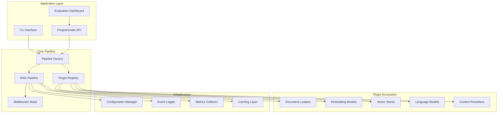
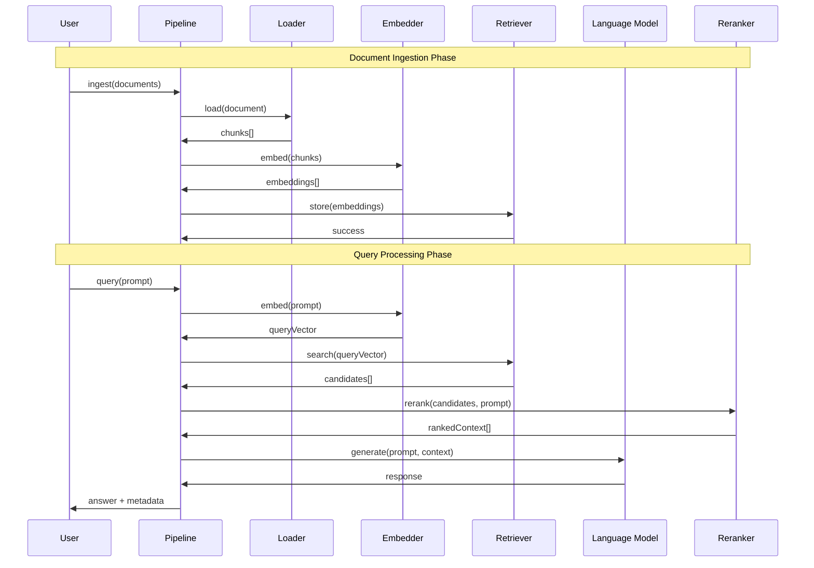

# Architecture

This comprehensive guide outlines the internal architecture of @DevilsDev/rag-pipeline-utils, emphasizing enterprise-grade modularity, plugin design patterns, and SOLID-compliant structure. Understanding this architecture is crucial for extending the system, creating custom plugins, and optimizing performance.

---

## 🏗️ Core Design Philosophy

The architecture is built on proven software engineering principles that ensure scalability, maintainability, and extensibility:

### **SOLID Principles Implementation**

- **Single Responsibility Principle (SRP)**: Each component handles one specific domain concern
  - Loaders only handle document ingestion
  - Embedders only convert text to vectors
  - Retrievers only manage vector storage and search
  - LLMs only generate responses

- **Open/Closed Principle (OCP)**: System is open for extension but closed for modification
  - New plugins can be added without changing core code
  - Plugin interfaces define stable contracts
  - Middleware can be injected without core changes

- **Liskov Substitution Principle (LSP)**: Any plugin can be replaced with another of the same type
  - All PDF loaders implement the same interface
  - OpenAI embedder can be swapped with Cohere embedder
  - Vector stores are interchangeable

- **Interface Segregation Principle (ISP)**: Plugins only depend on interfaces they use
  - Loaders don't depend on LLM interfaces
  - Embedders don't need retriever methods
  - Clean separation of concerns

- **Dependency Inversion Principle (DIP)**: High-level modules don't depend on low-level modules
  - Pipeline depends on plugin abstractions, not implementations
  - Configuration drives dependency injection
  - Easy testing with mock implementations

### **Additional Architectural Principles**

- **Plugin-Based Architecture**: Complete modularity with hot-swappable components
- **Streaming-First Design**: Async flows with real-time, token-by-token output
- **Configuration-Driven**: Environment-safe config via `.ragrc.json` files
- **Event-Driven Processing**: Comprehensive event system for monitoring and hooks
- **Fail-Fast Validation**: Early error detection with detailed error messages
- **Observability Built-In**: Comprehensive logging, tracing, and metrics collection

---

## 🔧 System Architecture Overview

### **High-Level Component Diagram**



### **Data Flow Architecture**



---

## 🔌 Plugin System Architecture

### **Plugin Registry Implementation**

The `PluginRegistry` is the heart of the plugin system, managing plugin lifecycle and dependency injection:

```typescript
// Core plugin registry structure
class PluginRegistry {
  private plugins: Map<string, Map<string, Plugin>> = new Map();
  private contracts: Map<string, PluginContract> = new Map();
  
  register<T extends Plugin>(
    type: PluginType, 
    name: string, 
    plugin: T,
    metadata?: PluginMetadata
  ): void {
    // Validate plugin against contract
    this.validateContract(type, plugin);
    
    // Register plugin with metadata
    if (!this.plugins.has(type)) {
      this.plugins.set(type, new Map());
    }
    this.plugins.get(type)!.set(name, plugin);
    
    // Emit registration event
    this.eventEmitter.emit('plugin:registered', {
      type, name, plugin, metadata
    });
  }
  
  get<T extends Plugin>(type: PluginType, name: string): T {
    const typePlugins = this.plugins.get(type);
    if (!typePlugins?.has(name)) {
      throw new PluginNotFoundError(`Plugin ${type}:${name} not found`);
    }
    return typePlugins.get(name) as T;
  }
  
  list(type?: PluginType): PluginInfo[] {
    // Return available plugins with metadata
  }
}
```

### **Plugin Contract System**

Each plugin type implements a strict contract interface:

```typescript
// Loader Plugin Contract
interface LoaderPlugin {
  readonly metadata: PluginMetadata;
  
  load(source: string | Buffer, options?: LoaderOptions): Promise<Document[]>;
  supports(mimeType: string): boolean;
  validate(source: string | Buffer): Promise<ValidationResult>;
}

// Embedder Plugin Contract
interface EmbedderPlugin {
  readonly metadata: PluginMetadata;
  
  embed(texts: string[], options?: EmbedderOptions): Promise<Embedding[]>;
  embedSingle(text: string, options?: EmbedderOptions): Promise<Embedding>;
  getDimensions(): number;
  getMaxTokens(): number;
}

// Retriever Plugin Contract
interface RetrieverPlugin {
  readonly metadata: PluginMetadata;
  
  store(embeddings: EmbeddingDocument[]): Promise<void>;
  search(query: Embedding, options?: SearchOptions): Promise<SearchResult[]>;
  delete(ids: string[]): Promise<void>;
  getStats(): Promise<IndexStats>;
}

// LLM Plugin Contract
interface LLMPlugin {
  readonly metadata: PluginMetadata;
  
  generate(prompt: string, context?: string[], options?: LLMOptions): AsyncIterable<string>;
  generateSync(prompt: string, context?: string[], options?: LLMOptions): Promise<string>;
  getTokenCount(text: string): number;
  getMaxContextLength(): number;
}
```

### **Plugin Metadata System**

```typescript
interface PluginMetadata {
  name: string;
  version: string;
  description: string;
  author: string;
  license: string;
  homepage?: string;
  repository?: string;
  keywords: string[];
  
  // Plugin-specific metadata
  capabilities: string[];
  requirements: {
    node: string;
    dependencies?: Record<string, string>;
    environment?: string[];
  };
  
  // Performance characteristics
  performance: {
    throughput?: string;
    latency?: string;
    memoryUsage?: string;
  };
  
  // Configuration schema
  configSchema?: JSONSchema;
}
```

---

## 🏭 Pipeline Factory Pattern

The `createRagPipeline` function implements the Factory pattern to create configured pipeline instances:

```typescript
export function createRagPipeline(config: PipelineConfig): RagPipeline {
  // Initialize plugin registry
  const registry = new PluginRegistry();
  
  // Register built-in plugins
  registerBuiltinPlugins(registry);
  
  // Load custom plugins from config
  if (config.plugins) {
    await loadCustomPlugins(registry, config.plugins);
  }
  
  // Resolve plugin instances
  const loader = registry.get('loader', config.loader);
  const embedder = registry.get('embedder', config.embedder);
  const retriever = registry.get('retriever', config.retriever);
  const llm = registry.get('llm', config.llm);
  const reranker = config.useReranker ? 
    registry.get('reranker', config.reranker || 'default') : null;
  
  // Create middleware stack
  const middleware = createMiddlewareStack(config.middleware || []);
  
  // Initialize pipeline with dependencies
  return new RagPipeline({
    loader,
    embedder,
    retriever,
    llm,
    reranker,
    middleware,
    config: config.pipelineConfig || {},
    eventEmitter: new EventEmitter(),
    logger: createLogger(config.logging || {}),
    metrics: new MetricsCollector(config.metrics || {})
  });
}
```

---

## 🔄 Middleware Architecture

The middleware system allows for cross-cutting concerns like retry logic, caching, and monitoring:

```typescript
// Middleware interface
interface Middleware {
  name: string;
  priority: number;
  
  beforeLoad?(context: LoadContext): Promise<LoadContext>;
  afterLoad?(context: LoadContext, result: Document[]): Promise<Document[]>;
  
  beforeEmbed?(context: EmbedContext): Promise<EmbedContext>;
  afterEmbed?(context: EmbedContext, result: Embedding[]): Promise<Embedding[]>;
  
  beforeRetrieve?(context: RetrieveContext): Promise<RetrieveContext>;
  afterRetrieve?(context: RetrieveContext, result: SearchResult[]): Promise<SearchResult[]>;
  
  beforeGenerate?(context: GenerateContext): Promise<GenerateContext>;
  afterGenerate?(context: GenerateContext, result: string): Promise<string>;
  
  onError?(error: Error, context: any): Promise<void>;
}

// Built-in middleware examples
class RetryMiddleware implements Middleware {
  constructor(private options: RetryOptions) {}
  
  async beforeGenerate(context: GenerateContext): Promise<GenerateContext> {
    context.retryCount = 0;
    context.maxRetries = this.options.maxRetries;
    return context;
  }
  
  async onError(error: Error, context: any): Promise<void> {
    if (context.retryCount < context.maxRetries) {
      context.retryCount++;
      // Implement exponential backoff
      await this.delay(Math.pow(2, context.retryCount) * 1000);
      throw new RetryableError(error);
    }
    throw error;
  }
}

class CachingMiddleware implements Middleware {
  constructor(private cache: Cache) {}
  
  async beforeEmbed(context: EmbedContext): Promise<EmbedContext> {
    const cacheKey = this.generateCacheKey(context.texts);
    const cached = await this.cache.get(cacheKey);
    if (cached) {
      context.cachedResult = cached;
    }
    return context;
  }
  
  async afterEmbed(context: EmbedContext, result: Embedding[]): Promise<Embedding[]> {
    if (!context.cachedResult) {
      const cacheKey = this.generateCacheKey(context.texts);
      await this.cache.set(cacheKey, result, { ttl: 3600 });
    }
    return context.cachedResult || result;
  }
}
```

---

## 📊 Event System & Observability

The architecture includes a comprehensive event system for monitoring, debugging, and analytics:

```typescript
// Event types emitted by the system
interface PipelineEvents {
  'pipeline:created': { config: PipelineConfig };
  'pipeline:destroyed': { pipelineId: string };
  
  'document:loading': { source: string, loader: string };
  'document:loaded': { source: string, chunks: number, duration: number };
  'document:error': { source: string, error: Error };
  
  'embedding:started': { texts: number, embedder: string };
  'embedding:completed': { embeddings: number, duration: number };
  'embedding:cached': { texts: number, cacheHit: boolean };
  
  'retrieval:query': { query: string, retriever: string };
  'retrieval:results': { results: number, duration: number };
  
  'generation:started': { prompt: string, llm: string };
  'generation:token': { token: string, position: number };
  'generation:completed': { response: string, duration: number, tokens: number };
  
  'error:handled': { error: Error, context: string, recovered: boolean };
}

// Event-driven metrics collection
class MetricsCollector {
  constructor(private config: MetricsConfig) {
    this.setupEventListeners();
  }
  
  private setupEventListeners(): void {
    // Track performance metrics
    this.on('embedding:completed', (event) => {
      this.histogram('embedding.duration', event.duration);
      this.counter('embedding.requests').inc();
    });
    
    this.on('generation:completed', (event) => {
      this.histogram('generation.duration', event.duration);
      this.histogram('generation.tokens', event.tokens);
      this.counter('generation.requests').inc();
    });
    
    // Track error rates
    this.on('error:handled', (event) => {
      this.counter('errors.total', {
        context: event.context,
        recovered: event.recovered.toString()
      }).inc();
    });
  }
}
```

---

## 🔒 Security Architecture

Security is built into the architecture at multiple levels:

### **Plugin Sandboxing**
- Plugins run in isolated contexts with limited system access
- API key management through secure configuration
- Input validation and sanitization at plugin boundaries

### **Configuration Security**
- Encrypted storage of sensitive configuration data
- Environment variable injection for secrets
- Configuration schema validation

### **Network Security**
- TLS/SSL enforcement for all external API calls
- Request rate limiting and timeout handling
- Secure credential rotation support

---

## 🏢 Enterprise Architecture Components

### **Dependency Injection Container**

The enterprise-grade dependency injection system provides IoC (Inversion of Control) for modular, testable architecture:

```typescript
// src/core/dependency-injection.js
class DependencyContainer {
  private services: Map<string, ServiceDefinition> = new Map();
  private instances: Map<string, any> = new Map();
  
  register<T>(name: string, factory: ServiceFactory<T>, options?: ServiceOptions): void {
    this.services.set(name, {
      factory,
      lifecycle: options?.lifecycle || 'singleton',
      dependencies: options?.dependencies || []
    });
  }
  
  resolve<T>(name: string): T {
    if (this.instances.has(name)) {
      return this.instances.get(name);
    }
    
    const service = this.services.get(name);
    if (!service) {
      throw new ServiceNotFoundError(`Service ${name} not registered`);
    }
    
    // Resolve dependencies
    const dependencies = service.dependencies.map(dep => this.resolve(dep));
    
    // Create instance
    const instance = service.factory(...dependencies);
    
    if (service.lifecycle === 'singleton') {
      this.instances.set(name, instance);
    }
    
    return instance;
  }
}
```

### **SLO Monitoring System**

Built-in Service Level Objectives tracking with error budgets and alerting:

```typescript
// src/observability/slo-monitor.js
class SLOMonitor {
  private slos: Map<string, SLODefinition> = new Map();
  private measurements: TimeSeriesDB = new TimeSeriesDB();
  
  defineSLO(name: string, definition: SLODefinition): void {
    this.slos.set(name, {
      ...definition,
      errorBudget: this.calculateErrorBudget(definition)
    });
  }
  
  recordMeasurement(sloName: string, success: boolean, latency?: number): void {
    const measurement = {
      timestamp: Date.now(),
      success,
      latency,
      slo: sloName
    };
    
    this.measurements.record(measurement);
    this.checkSLOViolation(sloName, measurement);
  }
  
  getErrorBudgetStatus(sloName: string): ErrorBudgetStatus {
    const slo = this.slos.get(sloName);
    const recentMeasurements = this.measurements.getRecent(sloName, slo.window);
    
    return {
      remaining: this.calculateRemainingBudget(slo, recentMeasurements),
      burnRate: this.calculateBurnRate(recentMeasurements),
      alerting: this.shouldAlert(slo, recentMeasurements)
    };
  }
}
```

### **External API Mocking Infrastructure**

Deterministic test infrastructure with network simulation for reliable CI/CD:

```typescript
// __tests__/mocks/external-apis.js
class ExternalAPIMocker {
  private mocks: Map<string, MockDefinition> = new Map();
  private networkSimulator: NetworkSimulator;
  
  mockAPI(service: string, config: MockConfig): void {
    this.mocks.set(service, {
      responses: config.responses,
      latency: config.latency || { min: 100, max: 500 },
      errorRate: config.errorRate || 0.05,
      rateLimiting: config.rateLimiting
    });
  }
  
  async simulateRequest(service: string, request: APIRequest): Promise<APIResponse> {
    const mock = this.mocks.get(service);
    
    // Simulate network conditions
    await this.networkSimulator.delay(mock.latency);
    
    // Simulate errors
    if (Math.random() < mock.errorRate) {
      throw new MockNetworkError('Simulated network failure');
    }
    
    // Return mock response
    return this.generateResponse(mock, request);
  }
}
```

---

## 🚀 Advanced AI Architecture

### **Multi-Modal Processing Engine**

Handle text, images, and structured data in unified pipelines:

```typescript
// src/ai/multimodal/multi-modal-processor.js
class MultiModalProcessor {
  private processors: Map<string, ModalityProcessor> = new Map();
  
  async process(input: MultiModalInput): Promise<ProcessedContent> {
    const results = await Promise.all(
      input.modalities.map(async (modality) => {
        const processor = this.processors.get(modality.type);
        return processor.process(modality.content, modality.metadata);
      })
    );
    
    return this.fuseResults(results, input.fusionStrategy);
  }
}
```

### **Federated Learning Coordinator**

Distributed model training with privacy-preserving aggregation:

```typescript
// src/ai/federation/federated-learning-coordinator.js
class FederatedLearningCoordinator {
  async coordinateTraining(participants: FederatedNode[]): Promise<GlobalModel> {
    // Distribute training tasks
    const localUpdates = await this.distributeTraining(participants);
    
    // Aggregate updates with differential privacy
    const aggregatedUpdate = await this.aggregateWithPrivacy(localUpdates);
    
    // Update global model
    return this.updateGlobalModel(aggregatedUpdate);
  }
}
```

### **Adaptive Retrieval Engine**

Dynamic retrieval strategies with performance optimization:

```typescript
// src/ai/retrieval/adaptive-retrieval-engine.js
class AdaptiveRetrievalEngine {
  async adaptiveRetrieve(query: Query, context: RetrievalContext): Promise<RetrievalResult> {
    // Analyze query complexity
    const strategy = await this.selectStrategy(query, context);
    
    // Execute retrieval with chosen strategy
    const results = await this.executeStrategy(strategy, query);
    
    // Learn from results for future optimization
    await this.updateStrategyPerformance(strategy, results);
    
    return results;
  }
}
```

---

## 🔧 Enhanced Developer Tools

### **CLI Doctor Diagnostics**

Comprehensive system health checking and troubleshooting:

```typescript
// src/cli/doctor-command.js
class DoctorCommand {
  async runDiagnostics(): Promise<DiagnosticReport> {
    const checks = [
      this.checkNodeVersion(),
      this.checkDependencies(),
      this.checkConfiguration(),
      this.checkPluginHealth(),
      this.checkExternalServices(),
      this.checkPerformanceBottlenecks()
    ];
    
    const results = await Promise.allSettled(checks);
    return this.generateReport(results);
  }
}
```

### **Plugin Marketplace**

Certified plugin ecosystem with discovery and installation workflows:

```typescript
// src/core/plugin-marketplace/marketplace.js
class PluginMarketplace {
  async discoverPlugins(criteria: SearchCriteria): Promise<PluginListing[]> {
    const plugins = await this.searchRegistry(criteria);
    return plugins.filter(plugin => this.meetsCertificationStandards(plugin));
  }
  
  async installPlugin(pluginId: string): Promise<InstallationResult> {
    // Verify plugin certification
    await this.verifyCertification(pluginId);
    
    // Install with security scanning
    return this.secureInstall(pluginId);
  }
}
```

---

*This enterprise-grade architecture enables @DevilsDev/rag-pipeline-utils to scale from simple prototypes to mission-critical production systems while maintaining flexibility, security, and observability. Continue to [Usage](./Usage.md) for practical implementation examples, or explore [Plugins](./Plugins.md) to learn about creating custom components.*
