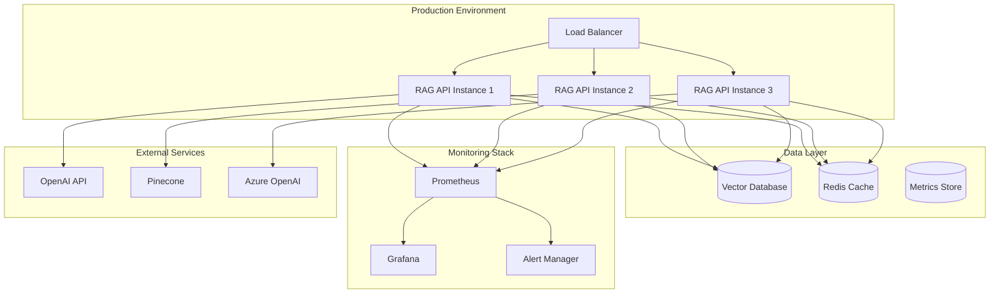

# Enterprise Features

@DevilsDev/rag-pipeline-utils provides comprehensive enterprise-grade capabilities for mission-critical RAG deployments. This guide covers the advanced features designed for production environments requiring high availability, security, and observability.

---

## 🏢 Enterprise Architecture Overview

### **Production-Ready Infrastructure**

The enterprise architecture is built on proven patterns and practices:

- **Dependency Injection Container**: IoC pattern for modular, testable code
- **SLO Monitoring System**: Service Level Objectives with error budgets and alerting
- **Semantic Release Automation**: Automated versioning and deployment pipelines
- **External API Mocking**: Deterministic testing with network simulation
- **Structured Observability**: Comprehensive logging, metrics, and tracing

### **Enterprise Deployment Model**



---

## 🔧 Dependency Injection Container

The enterprise IoC container provides modular, testable architecture with lifecycle management.

### **Service Registration**

```javascript
import { DependencyContainer } from "@DevilsDev/rag-pipeline-utils/enterprise";

const container = new DependencyContainer();

// Register singleton services
container.register(
  "logger",
  () =>
    new StructuredLogger({
      level: "info",
      correlationId: true,
      structured: true,
    }),
  { lifecycle: "singleton" },
);

// Register factory services with dependencies
container.register(
  "embedder",
  (logger) =>
    new OpenAIEmbedder({
      apiKey: process.env.OPENAI_API_KEY,
      logger,
    }),
  {
    lifecycle: "factory",
    dependencies: ["logger"],
  },
);

// Register with interface validation
container.registerInterface("retriever", PineconeRetriever, {
  implements: ["RetrieverPlugin"],
  dependencies: ["logger", "metrics"],
});
```

### **Service Resolution**

```javascript
// Resolve services with automatic dependency injection
const pipeline = container.resolve("ragPipeline");
const logger = container.resolve("logger");
const metrics = container.resolve("metricsCollector");

// Conditional resolution
const embedder = container.resolveConditional("embedder", {
  environment: "production",
  feature: "advanced-embeddings",
});
```

### **Lifecycle Management**

```javascript
// Graceful shutdown with dependency cleanup
process.on("SIGTERM", async () => {
  await container.shutdown({
    timeout: 30000,
    graceful: true,
  });
});

// Health checks for registered services
const healthStatus = await container.healthCheck();
console.log("Service Health:", healthStatus);
```

---

## 📊 SLO Monitoring System

Built-in Service Level Objectives tracking with error budgets, alerting, and automated remediation.

### **SLO Definition**

```javascript
import { SLOMonitor } from "@DevilsDev/rag-pipeline-utils/observability";

const sloMonitor = new SLOMonitor({
  storage: "prometheus",
  alerting: {
    webhook: process.env.SLACK_WEBHOOK_URL,
    channels: ["#rag-alerts", "#engineering"],
  },
});

// Define availability SLO
sloMonitor.defineSLO("rag-pipeline-availability", {
  objective: 0.999, // 99.9% availability
  window: "30d",
  errorBudget: {
    policy: "burn-rate",
    alertThresholds: [2, 5, 10], // 2x, 5x, 10x burn rates
  },
  indicators: [
    {
      name: "http_requests_success_rate",
      query:
        'sum(rate(http_requests_total{status!~"5.."}[5m])) / sum(rate(http_requests_total[5m]))',
    },
  ],
});

// Define latency SLO
sloMonitor.defineSLO("rag-pipeline-latency", {
  objective: 0.95, // 95% of requests under 2s
  window: "7d",
  threshold: 2000, // 2 seconds
  indicators: [
    {
      name: "response_time_p95",
      query:
        "histogram_quantile(0.95, rate(http_request_duration_seconds_bucket[5m]))",
    },
  ],
});
```

### **Real-Time Monitoring**

```javascript
// Record measurements
sloMonitor.recordMeasurement("rag-pipeline-availability", {
  success: true,
  timestamp: Date.now(),
  metadata: { endpoint: "/query", method: "POST" },
});

sloMonitor.recordMeasurement("rag-pipeline-latency", {
  success: true,
  latency: 1500, // 1.5 seconds
  timestamp: Date.now(),
});

// Get error budget status
const budgetStatus = await sloMonitor.getErrorBudgetStatus(
  "rag-pipeline-availability",
);
console.log("Error Budget Remaining:", budgetStatus.remaining);
console.log("Current Burn Rate:", budgetStatus.burnRate);

// Set up automated alerting
sloMonitor.on("slo:violation", (event) => {
  console.error("SLO Violation:", event);
  // Trigger automated remediation
  if (event.severity === "critical") {
    triggerAutoScaling();
  }
});
```

### **SLO Dashboard**

```javascript
// Generate SLO dashboard data
const dashboardData = await sloMonitor.generateDashboard({
  timeRange: "24h",
  slos: ["rag-pipeline-availability", "rag-pipeline-latency"],
  includeForecasting: true,
});

// Export SLO reports
const report = await sloMonitor.generateReport({
  format: "pdf",
  period: "monthly",
  recipients: ["engineering@company.com"],
});
```

---

## 🧪 External API Mocking Infrastructure

Deterministic testing infrastructure with network simulation for reliable CI/CD pipelines.

### **Mock Configuration**

```javascript
import { ExternalAPIMocker } from "@DevilsDev/rag-pipeline-utils/testing";

const mocker = new ExternalAPIMocker({
  deterministic: true,
  seed: "test-seed-123",
});

// Mock OpenAI API
mocker.mockAPI("openai", {
  baseURL: "https://api.openai.com",
  responses: {
    "/v1/embeddings": {
      success: {
        data: [{ embedding: [0.1, 0.2, 0.3] }],
        usage: { total_tokens: 10 },
      },
      errors: {
        rate_limit: { status: 429, message: "Rate limit exceeded" },
        invalid_key: { status: 401, message: "Invalid API key" },
      },
    },
    "/v1/chat/completions": {
      success: {
        choices: [{ message: { content: "Mocked response" } }],
        usage: { total_tokens: 50 },
      },
    },
  },
  latency: { min: 100, max: 500 },
  errorRate: 0.05,
  rateLimiting: {
    requestsPerMinute: 60,
    tokensPerMinute: 150000,
  },
});

// Mock Pinecone API
mocker.mockAPI("pinecone", {
  baseURL: "https://api.pinecone.io",
  responses: {
    "/vectors/upsert": { success: { upsertedCount: 100 } },
    "/query": {
      success: {
        matches: [
          { id: "doc1", score: 0.95, metadata: { text: "Sample text" } },
        ],
      },
    },
  },
  networkConditions: {
    bandwidth: "100mbps",
    latency: 50,
    packetLoss: 0.001,
  },
});
```

### **Test Integration**

```javascript
// Jest setup with mocking
beforeAll(async () => {
  await mocker.start();

  // Configure pipeline to use mocked endpoints
  process.env.OPENAI_BASE_URL = mocker.getEndpoint("openai");
  process.env.PINECONE_BASE_URL = mocker.getEndpoint("pinecone");
});

afterAll(async () => {
  await mocker.stop();
});

// Deterministic test scenarios
test("handles API rate limiting gracefully", async () => {
  // Configure mock to return rate limit errors
  mocker.setErrorRate("openai", 1.0, "rate_limit");

  const pipeline = createRagPipeline(testConfig);

  // Should retry and eventually succeed
  const result = await pipeline.query("test query");
  expect(result).toBeDefined();

  // Verify retry behavior
  const metrics = mocker.getMetrics("openai");
  expect(metrics.retryCount).toBeGreaterThan(0);
});

// Network condition simulation
test("handles poor network conditions", async () => {
  mocker.setNetworkConditions("openai", {
    latency: 2000, // 2s latency
    packetLoss: 0.1, // 10% packet loss
  });

  const startTime = Date.now();
  const result = await pipeline.query("test query");
  const duration = Date.now() - startTime;

  expect(duration).toBeGreaterThan(2000);
  expect(result).toBeDefined();
});
```

---

## 🤖 Advanced AI Capabilities

### **Multi-Modal Processing**

Handle text, images, and structured data in unified pipelines:

```javascript
import { MultiModalProcessor } from "@DevilsDev/rag-pipeline-utils/ai";

const processor = new MultiModalProcessor({
  textProcessor: "openai-embedder",
  imageProcessor: "clip-embedder",
  structuredProcessor: "table-embedder",
  fusionStrategy: "weighted-average",
});

// Process multi-modal document
const result = await processor.process({
  modalities: [
    { type: "text", content: "Document text content" },
    { type: "image", content: imageBuffer, metadata: { format: "png" } },
    { type: "table", content: csvData, metadata: { headers: true } },
  ],
  fusionWeights: { text: 0.5, image: 0.3, table: 0.2 },
});
```

### **Federated Learning**

Distributed model training with privacy preservation:

```javascript
import { FederatedLearningCoordinator } from "@DevilsDev/rag-pipeline-utils/ai";

const coordinator = new FederatedLearningCoordinator({
  aggregationStrategy: "federated-averaging",
  privacyBudget: 1.0,
  differentialPrivacy: true,
});

// Coordinate federated training
const globalModel = await coordinator.coordinateTraining({
  participants: federatedNodes,
  rounds: 10,
  clientSampleRatio: 0.1,
  localEpochs: 5,
});
```

### **Adaptive Retrieval**

Dynamic retrieval strategies with performance optimization:

```javascript
import { AdaptiveRetrievalEngine } from "@DevilsDev/rag-pipeline-utils/ai";

const engine = new AdaptiveRetrievalEngine({
  strategies: ["semantic", "keyword", "hybrid", "graph-based"],
  adaptationPolicy: "performance-based",
  learningRate: 0.01,
});

// Adaptive retrieval with strategy selection
const results = await engine.adaptiveRetrieve(query, {
  domain: "technical-documentation",
  userContext: { expertise: "intermediate" },
  performanceRequirements: { maxLatency: 500 },
});
```

---

## 🔒 Enterprise Security

### **Authentication & Authorization**

```javascript
import { EnterpriseAuth } from "@DevilsDev/rag-pipeline-utils/enterprise";

const auth = new EnterpriseAuth({
  provider: "azure-ad",
  tenantId: process.env.AZURE_TENANT_ID,
  clientId: process.env.AZURE_CLIENT_ID,
  rbac: {
    roles: ["admin", "user", "readonly"],
    permissions: {
      admin: ["*"],
      user: ["query", "ingest"],
      readonly: ["query"],
    },
  },
});

// Middleware for authentication
app.use(auth.middleware());

// Role-based access control
app.post("/ingest", auth.requireRole("user"), async (req, res) => {
  // Handle ingestion
});
```

### **Audit Logging**

```javascript
import { AuditLogger } from "@DevilsDev/rag-pipeline-utils/enterprise";

const auditLogger = new AuditLogger({
  storage: "elasticsearch",
  retention: "7y", // 7 years for compliance
  encryption: true,
  immutable: true,
});

// Log security-sensitive operations
auditLogger.log("document.ingest", {
  userId: req.user.id,
  documentId: doc.id,
  classification: "confidential",
  source: req.ip,
  timestamp: new Date().toISOString(),
});
```

---

## 📈 Production Deployment

### **Kubernetes Deployment**

```yaml
# deployment/kubernetes/rag-pipeline-deployment.yaml
apiVersion: apps/v1
kind: Deployment
metadata:
  name: rag-pipeline
  labels:
    app: rag-pipeline
spec:
  replicas: 3
  selector:
    matchLabels:
      app: rag-pipeline
  template:
    metadata:
      labels:
        app: rag-pipeline
    spec:
      containers:
        - name: rag-pipeline
          image: devilsdev/rag-pipeline-utils:latest
          ports:
            - containerPort: 3000
          env:
            - name: NODE_ENV
              value: "production"
            - name: OPENAI_API_KEY
              valueFrom:
                secretKeyRef:
                  name: api-secrets
                  key: openai-key
          resources:
            requests:
              memory: "512Mi"
              cpu: "250m"
            limits:
              memory: "1Gi"
              cpu: "500m"
          livenessProbe:
            httpGet:
              path: /health
              port: 3000
            initialDelaySeconds: 30
            periodSeconds: 10
          readinessProbe:
            httpGet:
              path: /ready
              port: 3000
            initialDelaySeconds: 5
            periodSeconds: 5
```

### **Helm Chart Configuration**

```yaml
# deployment/helm/rag-pipeline/values.yaml
replicaCount: 3

image:
  repository: devilsdev/rag-pipeline-utils
  tag: "latest"
  pullPolicy: IfNotPresent

service:
  type: ClusterIP
  port: 80
  targetPort: 3000

ingress:
  enabled: true
  className: "nginx"
  annotations:
    cert-manager.io/cluster-issuer: "letsencrypt-prod"
  hosts:
    - host: rag-api.company.com
      paths:
        - path: /
          pathType: Prefix
  tls:
    - secretName: rag-api-tls
      hosts:
        - rag-api.company.com

monitoring:
  enabled: true
  serviceMonitor:
    enabled: true
    interval: 30s
    scrapeTimeout: 10s

autoscaling:
  enabled: true
  minReplicas: 3
  maxReplicas: 10
  targetCPUUtilizationPercentage: 70
  targetMemoryUtilizationPercentage: 80
```

---

_This enterprise feature set enables @DevilsDev/rag-pipeline-utils to meet the demanding requirements of mission-critical production environments while maintaining the flexibility and ease of use that makes it valuable for development and prototyping._
