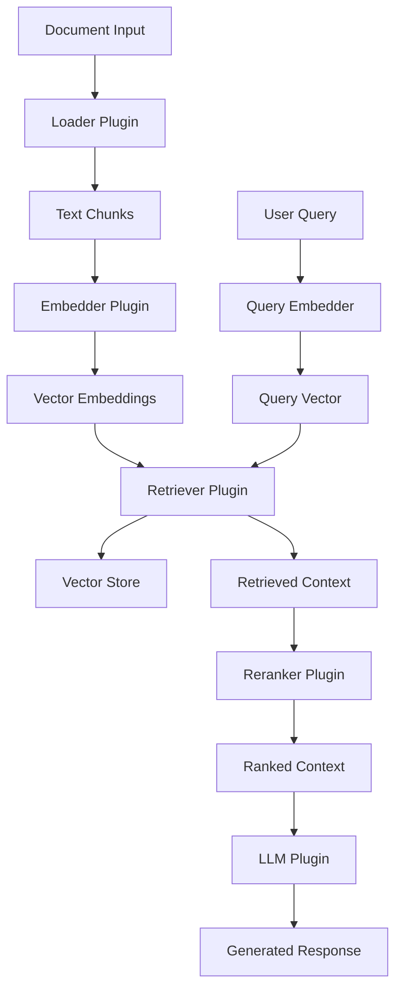

# Introduction

Welcome to **@DevilsDev/rag-pipeline-utils**, a production-ready, modular Node.js toolkit for building scalable, enterprise-grade Retrieval-Augmented Generation (RAG) systems. This comprehensive library provides everything you need to create sophisticated RAG pipelines with pluggable components, streaming support, and built-in evaluation capabilities.

---

## 🎯 What is RAG?

Retrieval-Augmented Generation (RAG) is a powerful AI architecture that combines information retrieval with large language models to enhance text generation with factual, contextual grounding. Unlike traditional LLMs that rely solely on training data, RAG systems dynamically retrieve relevant information to inform responses.

### The RAG Process

1. **Document Ingestion**: Load and chunk documents into manageable pieces
2. **Embedding Generation**: Convert text chunks into vector representations
3. **Vector Storage**: Store embeddings in a searchable vector database
4. **Query Processing**: Convert user queries into vector representations
5. **Retrieval**: Find the most relevant document chunks using similarity search
6. **Context Augmentation**: Combine retrieved context with the original query
7. **Generation**: Use an LLM to generate responses informed by the retrieved context

### Real-World Applications

- **Knowledge Base Q&A**: Answer questions from internal documentation
- **Customer Support**: Provide accurate responses from support articles
- **Research Assistance**: Synthesize information from academic papers
- **Code Documentation**: Generate explanations from codebases
- **Legal Document Analysis**: Extract insights from legal texts

---

## 🚀 Why Choose @DevilsDev/rag-pipeline-utils?

### **Enterprise-Grade Architecture**
- **SOLID Principles**: Clean, maintainable, and extensible codebase
- **Plugin-Based Design**: Swap components without breaking changes
- **Type Safety**: Full TypeScript support with comprehensive type definitions
- **Production Testing**: Extensive unit and integration test coverage
- **CI/CD Ready**: GitHub Actions workflows for automated testing and deployment

### **Developer Experience**
- **Dual Interface**: Use via CLI for quick tasks or API for integration
- **Streaming Support**: Real-time, token-by-token response generation
- **Configuration-Driven**: Manage settings via `.ragrc.json` files
- **Hot Reloading**: Dynamic plugin loading and configuration updates
- **Comprehensive Logging**: Built-in observability and debugging tools

### **Built-in Evaluation**
- **Multiple Metrics**: BLEU, ROUGE, BERTScore, and semantic similarity
- **Interactive Dashboard**: React-based evaluation UI with dark mode
- **Batch Processing**: Evaluate multiple queries simultaneously
- **Export Capabilities**: CSV export and detailed reporting

### **Extensibility**
- **Custom Plugins**: Create your own loaders, embedders, and retrievers
- **Middleware Support**: Add retry logic, caching, and custom processing
- **DAG Workflows**: Build complex, multi-step processing pipelines
- **Event System**: Hook into pipeline events for monitoring and analytics

---

## 🏗️ Core Architecture

The toolkit follows a modular, plugin-based architecture where each component has a specific responsibility:



### Core Components

#### **Loader Plugins**
Handle document ingestion and preprocessing:
- `pdf-loader`: Extract text from PDF documents
- `markdown-loader`: Process Markdown files with metadata
- `html-loader`: Parse HTML content and extract text
- `docx-loader`: Handle Microsoft Word documents
- `csv-loader`: Process structured CSV data

#### **Embedder Plugins**
Convert text into vector representations:
- `openai-embedder`: Use OpenAI's text-embedding models
- `cohere-embedder`: Leverage Cohere's embedding API
- `huggingface-embedder`: Local embeddings via Hugging Face
- `sentence-transformers`: High-performance local embeddings

#### **Retriever Plugins**
Manage vector storage and similarity search:
- `pinecone-retriever`: Cloud-native vector database
- `chroma-retriever`: Open-source vector store
- `weaviate-retriever`: GraphQL-based vector database
- `qdrant-retriever`: High-performance vector search engine

#### **LLM Plugins**
Generate responses using language models:
- `openai-llm`: GPT-3.5, GPT-4, and GPT-4 Turbo
- `anthropic-llm`: Claude models with large context windows
- `ollama-llm`: Local LLM execution with Ollama
- `azure-openai-llm`: Enterprise Azure OpenAI integration

---

## 📦 Quick Start Example

Here's a complete example showing how to set up and use a RAG pipeline:

```javascript
import { createRagPipeline } from '@DevilsDev/rag-pipeline-utils';

// Create a pipeline with your preferred components
const pipeline = createRagPipeline({
  loader: 'markdown',
  embedder: 'openai',
  retriever: 'pinecone',
  llm: 'openai-gpt-4',
  useReranker: true,
  config: {
    openai: {
      apiKey: process.env.OPENAI_API_KEY,
      model: 'text-embedding-3-large'
    },
    pinecone: {
      apiKey: process.env.PINECONE_API_KEY,
      environment: 'us-west1-gcp',
      indexName: 'rag-documents'
    }
  }
});

// Ingest documents
await pipeline.ingest('./docs/**/*.md');

// Query the pipeline
const response = await pipeline.query(
  "How do I implement custom plugins?"
);

console.log(response.answer);
console.log(`Sources: ${response.sources.length} documents`);
console.log(`Confidence: ${response.confidence}`);
```

### CLI Usage

```bash
# Install globally
npm install -g @DevilsDev/rag-pipeline-utils

# Initialize a new project
rag-pipeline init my-rag-project

# Ingest documents
rag-pipeline ingest ./docs --loader markdown --embedder openai

# Query your knowledge base
rag-pipeline query "What is the plugin architecture?" --llm openai-gpt-4

# Run evaluation
rag-pipeline evaluate ./test-queries.json --output results.csv

# Start the evaluation dashboard
rag-pipeline dashboard --port 3000
```

---

## 🎯 Project Status & Roadmap

### **Current Status: Production Ready v2.1.8**

✅ **Completed Features:**
- Core pipeline architecture with plugin system
- 15+ built-in plugins for major services
- Streaming response generation
- Comprehensive evaluation suite with dashboard
- CLI tools and interactive workflows
- Full TypeScript support
- 95%+ test coverage
- GitHub Actions CI/CD

🚧 **Active Development:**
- Advanced reranking algorithms
- Multi-modal document support (images, tables)
- Distributed processing capabilities
- Enhanced observability and monitoring
- Plugin marketplace and discovery

🔮 **Upcoming Features:**
- GraphRAG implementation
- Agentic workflows and tool calling
- Fine-tuning integration
- Advanced caching strategies
- Kubernetes deployment templates

---

## 🤝 Community & Support

- **GitHub Repository**: [DevilsDev/rag-pipeline-utils](https://github.com/DevilsDev/rag-pipeline-utils)
- **Documentation**: [https://devilsdev.github.io/rag-pipeline-utils](https://devilsdev.github.io/rag-pipeline-utils)
- **NPM Package**: [@DevilsDev/rag-pipeline-utils](https://www.npmjs.com/package/@DevilsDev/rag-pipeline-utils)
- **Issues & Bug Reports**: [GitHub Issues](https://github.com/DevilsDev/rag-pipeline-utils/issues)
- **Discussions**: [GitHub Discussions](https://github.com/DevilsDev/rag-pipeline-utils/discussions)

### Contributing

We welcome contributions! See our [Contributing Guide](https://github.com/DevilsDev/rag-pipeline-utils/blob/main/CONTRIBUTING.md) for details on:
- Setting up the development environment
- Running tests and linting
- Submitting pull requests
- Creating new plugins
- Writing documentation

---

*Ready to build powerful RAG applications? Continue to the [Architecture](./Architecture.md) guide to understand the system design, or jump to [Usage](./Usage.md) for hands-on examples.*
- Compatible with Node.js `>=18`
- Published to npm under `DevilsDev`

---

Let’s get started!

Next → [Usage](./Usage.md)
