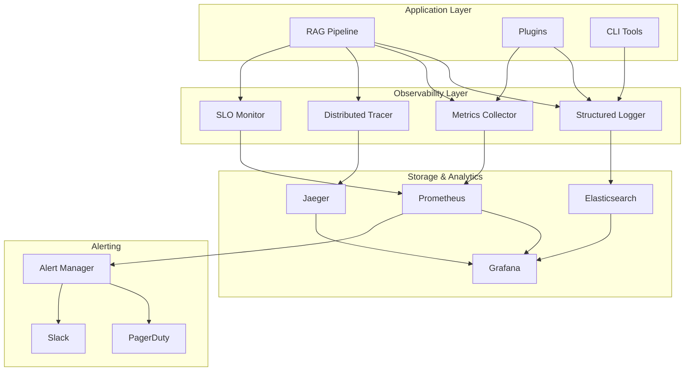

# Observability & Monitoring

Comprehensive observability is essential for production RAG systems. @DevilsDev/rag-pipeline-utils provides built-in monitoring, logging, tracing, and alerting capabilities designed for enterprise environments.

---

## Monitoring Architecture

### **Multi-Layer Observability Stack**



---

## Structured Logging

### **Logger Configuration**

```javascript
import { StructuredLogger } from "@DevilsDev/rag-pipeline-utils/observability";

const logger = new StructuredLogger({
  level: "info",
  format: "json",
  correlationId: true,
  sanitization: {
    enabled: true,
    patterns: ["password", "apiKey", "token"],
  },
  outputs: [
    {
      type: "console",
      level: "debug",
    },
    {
      type: "file",
      path: "/var/log/rag-pipeline/app.log",
      level: "info",
      rotation: {
        maxSize: "100MB",
        maxFiles: 10,
      },
    },
    {
      type: "elasticsearch",
      host: "elasticsearch.monitoring.svc.cluster.local",
      index: "rag-pipeline-logs",
      level: "warn",
    },
  ],
});
```

### **Contextual Logging**

```javascript
// Request-scoped logging with correlation IDs
app.use((req, res, next) => {
  req.correlationId = generateCorrelationId();
  req.logger = logger.child({
    correlationId: req.correlationId,
    requestId: req.id,
    userId: req.user?.id,
  });
  next();
});

// Pipeline operation logging
class RagPipeline {
  async query(prompt, options = {}) {
    const operationId = generateOperationId();
    const startTime = Date.now();

    this.logger.info("query.started", {
      operationId,
      prompt: sanitizePrompt(prompt),
      options: sanitizeOptions(options),
      timestamp: new Date().toISOString(),
    });

    try {
      // Execute query
      const result = await this.executeQuery(prompt, options);

      this.logger.info("query.completed", {
        operationId,
        duration: Date.now() - startTime,
        resultCount: result.sources?.length || 0,
        confidence: result.confidence,
        tokensUsed: result.usage?.totalTokens,
      });

      return result;
    } catch (error) {
      this.logger.error("query.failed", {
        operationId,
        duration: Date.now() - startTime,
        error: {
          name: error.name,
          message: error.message,
          stack: error.stack,
          code: error.code,
        },
      });
      throw error;
    }
  }
}
```

### **Security & Compliance Logging**

```javascript
// Audit logging for security events
const auditLogger = logger.child({
  component: "security",
  audit: true,
});

// Authentication events
auditLogger.info("auth.login", {
  userId: user.id,
  method: "oauth2",
  provider: "azure-ad",
  sourceIp: req.ip,
  userAgent: req.get("User-Agent"),
  success: true,
});

// Data access events
auditLogger.info("data.access", {
  userId: user.id,
  resource: "document",
  resourceId: doc.id,
  action: "read",
  classification: doc.classification,
  authorized: true,
});

// Configuration changes
auditLogger.warn("config.changed", {
  userId: admin.id,
  component: "pipeline",
  changes: {
    "embedder.model": {
      from: "text-embedding-ada-002",
      to: "text-embedding-3-large",
    },
    "retriever.topK": { from: 5, to: 10 },
  },
});
```

---

## Metrics Collection

### **Performance Metrics**

```javascript
import { MetricsCollector } from "@DevilsDev/rag-pipeline-utils/observability";

const metrics = new MetricsCollector({
  prefix: "rag_pipeline",
  labels: {
    service: "rag-api",
    version: process.env.APP_VERSION,
    environment: process.env.NODE_ENV,
  },
  exporters: [
    {
      type: "prometheus",
      port: 9090,
      path: "/metrics",
    },
    {
      type: "statsd",
      host: "statsd.monitoring.svc.cluster.local",
      port: 8125,
    },
  ],
});

// Request metrics
const requestDuration = metrics.histogram("request_duration_seconds", {
  help: "Request duration in seconds",
  buckets: [0.1, 0.5, 1, 2, 5, 10],
});

const requestCount = metrics.counter("requests_total", {
  help: "Total number of requests",
  labelNames: ["method", "endpoint", "status"],
});

// Pipeline-specific metrics
const embeddingDuration = metrics.histogram("embedding_duration_seconds", {
  help: "Embedding generation duration",
  buckets: [0.1, 0.5, 1, 2, 5],
  labelNames: ["provider", "model"],
});

const retrievalAccuracy = metrics.gauge("retrieval_accuracy", {
  help: "Retrieval accuracy score",
  labelNames: ["retriever", "query_type"],
});

const tokenUsage = metrics.counter("tokens_used_total", {
  help: "Total tokens consumed",
  labelNames: ["provider", "model", "operation"],
});
```

### **Business Metrics**

```javascript
// User engagement metrics
const queryCount = metrics.counter("queries_total", {
  help: "Total queries processed",
  labelNames: ["user_type", "domain"],
});

const userSatisfaction = metrics.histogram("user_satisfaction_score", {
  help: "User satisfaction ratings",
  buckets: [1, 2, 3, 4, 5],
});

// Cost tracking
const apiCosts = metrics.counter("api_costs_usd", {
  help: "API costs in USD",
  labelNames: ["provider", "service"],
});

// Data quality metrics
const documentFreshness = metrics.gauge("document_freshness_hours", {
  help: "Age of documents in hours",
  labelNames: ["source", "category"],
});
```

---

## Distributed Tracing

### **Trace Configuration**

```javascript
import { DistributedTracer } from "@DevilsDev/rag-pipeline-utils/observability";

const tracer = new DistributedTracer({
  serviceName: "rag-pipeline",
  version: process.env.APP_VERSION,
  environment: process.env.NODE_ENV,
  exporters: [
    {
      type: "jaeger",
      endpoint:
        "http://jaeger-collector.monitoring.svc.cluster.local:14268/api/traces",
    },
    {
      type: "zipkin",
      endpoint: "http://zipkin.monitoring.svc.cluster.local:9411/api/v2/spans",
    },
  ],
  sampling: {
    type: "probabilistic",
    rate: 0.1, // 10% sampling rate
  },
});
```

### **Pipeline Tracing**

```javascript
class RagPipeline {
  async query(prompt, options = {}) {
    const span = tracer.startSpan("rag.query", {
      tags: {
        "query.length": prompt.length,
        "query.type": options.type || "general",
        "user.id": options.userId,
      },
    });

    try {
      // Trace embedding generation
      const embeddingSpan = tracer.startSpan("rag.embed", { parent: span });
      const queryEmbedding = await this.embedder.embed(prompt);
      embeddingSpan.setTag("embedding.dimensions", queryEmbedding.length);
      embeddingSpan.finish();

      // Trace retrieval
      const retrievalSpan = tracer.startSpan("rag.retrieve", { parent: span });
      const context = await this.retriever.search(queryEmbedding, options);
      retrievalSpan.setTag("retrieval.results", context.length);
      retrievalSpan.setTag("retrieval.topK", options.topK || 5);
      retrievalSpan.finish();

      // Trace LLM generation
      const generationSpan = tracer.startSpan("rag.generate", { parent: span });
      const response = await this.llm.generate(prompt, context);
      generationSpan.setTag("generation.tokens", response.usage.totalTokens);
      generationSpan.setTag("generation.model", this.llm.model);
      generationSpan.finish();

      span.setTag("query.success", true);
      return response;
    } catch (error) {
      span.setTag("query.success", false);
      span.setTag("error.name", error.name);
      span.setTag("error.message", error.message);
      throw error;
    } finally {
      span.finish();
    }
  }
}
```

### **Cross-Service Tracing**

```javascript
// Propagate trace context across service boundaries
app.use((req, res, next) => {
  const traceContext = tracer.extract(req.headers);
  req.traceContext = traceContext;
  next();
});

// External API calls with trace propagation
class OpenAIEmbedder {
  async embed(texts) {
    const span = tracer.startSpan("openai.embed", {
      parent: this.traceContext,
    });

    const headers = {};
    tracer.inject(span, headers);

    try {
      const response = await fetch("https://api.openai.com/v1/embeddings", {
        method: "POST",
        headers: {
          ...headers,
          Authorization: `Bearer ${this.apiKey}`,
          "Content-Type": "application/json",
        },
        body: JSON.stringify({
          input: texts,
          model: this.model,
        }),
      });

      span.setTag("openai.model", this.model);
      span.setTag("openai.tokens", response.usage.total_tokens);
      span.setTag("http.status_code", response.status);

      return response.data;
    } catch (error) {
      span.setTag("error", true);
      span.log({ error: error.message });
      throw error;
    } finally {
      span.finish();
    }
  }
}
```

---

## Alerting & Incident Response

### **Alert Configuration**

```javascript
import { AlertManager } from "@DevilsDev/rag-pipeline-utils/observability";

const alertManager = new AlertManager({
  channels: [
    {
      name: "slack-critical",
      type: "slack",
      webhook: process.env.SLACK_WEBHOOK_CRITICAL,
      severity: ["critical", "high"],
    },
    {
      name: "pagerduty",
      type: "pagerduty",
      integrationKey: process.env.PAGERDUTY_INTEGRATION_KEY,
      severity: ["critical"],
    },
    {
      name: "email-team",
      type: "email",
      recipients: ["engineering@company.com"],
      severity: ["high", "medium"],
    },
  ],
});

// Define alert rules
alertManager.defineAlert("high-error-rate", {
  condition: 'rate(http_requests_total{status=~"5.."}[5m]) > 0.05',
  duration: "2m",
  severity: "high",
  summary: "High error rate detected",
  description: "Error rate is above 5% for 2 minutes",
  runbook: "https://wiki.company.com/runbooks/high-error-rate",
});

alertManager.defineAlert("embedding-latency", {
  condition:
    "histogram_quantile(0.95, rate(embedding_duration_seconds_bucket[5m])) > 2",
  duration: "5m",
  severity: "medium",
  summary: "High embedding latency",
  description: "95th percentile embedding latency is above 2 seconds",
});

alertManager.defineAlert("api-quota-exhausted", {
  condition: "openai_quota_remaining < 0.1",
  duration: "1m",
  severity: "critical",
  summary: "OpenAI API quota nearly exhausted",
  description: "Less than 10% of OpenAI quota remaining",
});
```

### **Automated Incident Response**

```javascript
// Incident response automation
alertManager.on("alert:triggered", async (alert) => {
  if (alert.severity === "critical") {
    // Auto-scale resources
    await scaleResources({
      service: "rag-pipeline",
      replicas: Math.min(currentReplicas * 2, maxReplicas),
    });

    // Enable circuit breaker
    await enableCircuitBreaker("external-apis");

    // Switch to backup providers
    if (alert.name === "api-quota-exhausted") {
      await switchToBackupProvider("embedder");
    }
  }

  // Create incident ticket
  const incident = await createIncident({
    title: alert.summary,
    description: alert.description,
    severity: alert.severity,
    assignee: getOnCallEngineer(),
    labels: ["rag-pipeline", "production"],
  });

  // Update alert with incident link
  alert.incidentId = incident.id;
});
```

---

## Grafana Dashboards

### **Operational Dashboard**

```json
{
  "dashboard": {
    "title": "RAG Pipeline Operations",
    "panels": [
      {
        "title": "Request Rate",
        "type": "stat",
        "targets": [
          {
            "expr": "sum(rate(rag_pipeline_requests_total[5m]))",
            "legendFormat": "Requests/sec"
          }
        ]
      },
      {
        "title": "Response Time",
        "type": "timeseries",
        "targets": [
          {
            "expr": "histogram_quantile(0.50, rate(rag_pipeline_request_duration_seconds_bucket[5m]))",
            "legendFormat": "p50"
          },
          {
            "expr": "histogram_quantile(0.95, rate(rag_pipeline_request_duration_seconds_bucket[5m]))",
            "legendFormat": "p95"
          },
          {
            "expr": "histogram_quantile(0.99, rate(rag_pipeline_request_duration_seconds_bucket[5m]))",
            "legendFormat": "p99"
          }
        ]
      },
      {
        "title": "Error Rate",
        "type": "timeseries",
        "targets": [
          {
            "expr": "sum(rate(rag_pipeline_requests_total{status=~\"5..\"}[5m])) / sum(rate(rag_pipeline_requests_total[5m]))",
            "legendFormat": "Error Rate"
          }
        ]
      },
      {
        "title": "SLO Status",
        "type": "table",
        "targets": [
          {
            "expr": "slo_error_budget_remaining",
            "format": "table"
          }
        ]
      }
    ]
  }
}
```

### **Business Metrics Dashboard**

```json
{
  "dashboard": {
    "title": "RAG Pipeline Business Metrics",
    "panels": [
      {
        "title": "Daily Active Users",
        "type": "stat",
        "targets": [
          {
            "expr": "count(count by (user_id) (rag_pipeline_queries_total[24h]))",
            "legendFormat": "DAU"
          }
        ]
      },
      {
        "title": "Query Volume by Domain",
        "type": "piechart",
        "targets": [
          {
            "expr": "sum by (domain) (rate(rag_pipeline_queries_total[24h]))",
            "legendFormat": "{{domain}}"
          }
        ]
      },
      {
        "title": "API Costs",
        "type": "timeseries",
        "targets": [
          {
            "expr": "sum by (provider) (rate(rag_pipeline_api_costs_usd[1h]))",
            "legendFormat": "{{provider}}"
          }
        ]
      },
      {
        "title": "User Satisfaction",
        "type": "gauge",
        "targets": [
          {
            "expr": "avg(rag_pipeline_user_satisfaction_score)",
            "legendFormat": "Average Rating"
          }
        ]
      }
    ]
  }
}
```

---

## Health Checks & Readiness Probes

### **Health Check Implementation**

```javascript
import { HealthChecker } from "@DevilsDev/rag-pipeline-utils/observability";

const healthChecker = new HealthChecker({
  checks: [
    {
      name: "database",
      check: async () => {
        const result = await db.ping();
        return { status: "healthy", latency: result.latency };
      },
      timeout: 5000,
      critical: true,
    },
    {
      name: "vector-store",
      check: async () => {
        const result = await vectorStore.healthCheck();
        return { status: result.status, indexCount: result.indexCount };
      },
      timeout: 3000,
      critical: true,
    },
    {
      name: "openai-api",
      check: async () => {
        const result = await openaiClient.healthCheck();
        return { status: "healthy", quotaRemaining: result.quota };
      },
      timeout: 10000,
      critical: false,
    },
  ],
});

// Express health endpoints
app.get("/health", async (req, res) => {
  const health = await healthChecker.check();
  res.status(health.status === "healthy" ? 200 : 503).json(health);
});

app.get("/ready", async (req, res) => {
  const readiness = await healthChecker.checkReadiness();
  res.status(readiness.ready ? 200 : 503).json(readiness);
});
```

---

_This comprehensive observability framework ensures your RAG pipeline operates reliably in production with full visibility into performance, errors, and business metrics. Continue to [Security](./Security.md) for information about securing your deployment._
