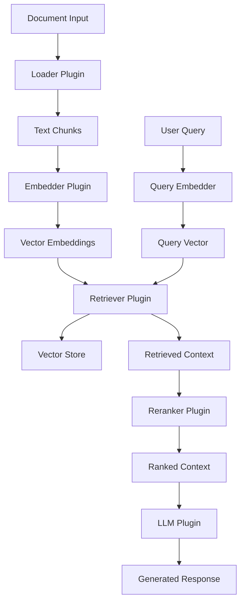

# Introduction

Welcome to **@DevilsDev/rag-pipeline-utils**, a production-ready, modular Node.js toolkit for building scalable, enterprise-grade Retrieval-Augmented Generation (RAG) systems. This comprehensive library provides everything you need to create sophisticated RAG pipelines with pluggable components, streaming support, and built-in evaluation capabilities.

---

## What is RAG?

Retrieval-Augmented Generation (RAG) is a powerful AI architecture that combines information retrieval with large language models to enhance text generation with factual, contextual grounding. Unlike traditional LLMs that rely solely on training data, RAG systems dynamically retrieve relevant information to inform responses.

### The RAG Process

1. **Document Ingestion**: Load and chunk documents into manageable pieces
2. **Embedding Generation**: Convert text chunks into vector representations
3. **Vector Storage**: Store embeddings in a searchable vector database
4. **Query Processing**: Convert user queries into vector representations
5. **Retrieval**: Find the most relevant document chunks using similarity search
6. **Context Augmentation**: Combine retrieved context with the original query
7. **Generation**: Use an LLM to generate responses informed by the retrieved context

### Real-World Applications

- **Knowledge Base Q&A**: Answer questions from internal documentation
- **Customer Support**: Provide accurate responses from support articles
- **Research Assistance**: Synthesize information from academic papers
- **Code Documentation**: Generate explanations from codebases
- **Legal Document Analysis**: Extract insights from legal texts

---

## Why Choose @DevilsDev/rag-pipeline-utils?

:::info Feature Availability
Features are marked with accessibility indicators:

- ✅ **Public API** - Available via `require('@devilsdev/rag-pipeline-utils')`
- 🔧 **CLI Tool** - Available through the `rag-pipeline` command-line interface
- 📦 **CLI/Internal** - Internal implementation not exported in public API
  :::

### **Enterprise-Grade Architecture**

- **Plugin Registry System**: ✅ Public API - Register and manage custom plugins with type-safe contracts
- **Semantic Release Automation**: ✅ Public API - Automated versioning via npm scripts
- **External API Mocking**: 🔧 Testing Infrastructure - Deterministic test infrastructure with network simulation
- **Production Observability**: ✅ Public API - Structured logging with `logger`, `eventLogger`, and `metrics` exports
- **SLO Monitoring System**: 📦 CLI/Internal - Service Level Objectives tracking (not in public API)

### **Advanced AI Capabilities**

- **Multi-Modal Processing**: ✅ Public API - `MultiModalProcessor` for text, images, and structured data
- **Adaptive Retrieval Engine**: ✅ Public API - `AdaptiveRetrievalEngine` with learning-based optimization
- **Plugin-Based Architecture**: ✅ Public API - Custom embedders, retrievers, LLMs, and rerankers
- **Federated Learning**: 📦 CLI/Internal - Distributed model training (not in public API)
- **Model Training Orchestrator**: 📦 CLI/Internal - Training workflows (not in public API)

### **Developer Experience Excellence**

- **Enhanced CLI Suite**: 🔧 CLI Tool - Interactive wizards, doctor diagnostics, and plugin management
- **Configuration Schema**: ✅ Public API - `loadConfig`, `validateRagrc`, `normalizeConfig` for `.ragrc.json`
- **Hot Module Reloading**: ✅ Public API - `HotReloadManager` and `createHotReloadManager` for development
- **Dev Server**: ✅ Public API - `DevServer` and `createDevServer` with debugging support
- **Plugin Marketplace**: 📦 CLI/Internal - Plugin discovery system (not in public API)

### **Production Monitoring & Analytics**

- **Audit Logging**: ✅ Public API - `AuditLogger` for compliance and security logging
- **Data Governance**: ✅ Public API - `DataGovernance` for multi-tenant isolation and quotas
- **Metrics Collection**: ✅ Public API - `metrics` module with Prometheus-compatible exports
- **Event Logging**: ✅ Public API - `eventLogger` for structured event tracking
- **Parallel Processing**: ✅ Public API - `ParallelProcessor` for concurrent document processing
- **SLO Dashboard**: 📦 CLI/Internal - Service health monitoring (not in public API)

---

## Core Architecture

The toolkit follows a modular, plugin-based architecture where each component has a specific responsibility:



### Core Components

#### **Loader Plugins**

Handle document ingestion and preprocessing:

- `pdf-loader`: Extract text from PDF documents
- `markdown-loader`: Process Markdown files with metadata
- `html-loader`: Parse HTML content and extract text
- `docx-loader`: Handle Microsoft Word documents
- `csv-loader`: Process structured CSV data

#### **Embedder Plugins**

Convert text into vector representations:

- `openai-embedder`: Use OpenAI's text-embedding models
- `cohere-embedder`: Leverage Cohere's embedding API
- `huggingface-embedder`: Local embeddings via Hugging Face
- `sentence-transformers`: High-performance local embeddings

#### **Retriever Plugins**

Manage vector storage and similarity search:

- `pinecone-retriever`: Cloud-native vector database
- `chroma-retriever`: Open-source vector store
- `weaviate-retriever`: GraphQL-based vector database
- `qdrant-retriever`: High-performance vector search engine

#### **LLM Plugins**

Generate responses using language models:

- `openai-llm`: GPT-3.5, GPT-4, and GPT-4 Turbo
- `anthropic-llm`: Claude models with large context windows
- `ollama-llm`: Local LLM execution with Ollama
- `azure-openai-llm`: Enterprise Azure OpenAI integration

---

## Quick Start Example

Here's a complete example showing how to set up and use a RAG pipeline:

```javascript
import { createRagPipeline } from "@DevilsDev/rag-pipeline-utils";

// Create a pipeline with your preferred components
const pipeline = createRagPipeline({
  loader: "markdown",
  embedder: "openai",
  retriever: "pinecone",
  llm: "openai-gpt-4",
  useReranker: true,
  config: {
    openai: {
      apiKey: process.env.OPENAI_API_KEY,
      model: "text-embedding-3-large",
    },
    pinecone: {
      apiKey: process.env.PINECONE_API_KEY,
      environment: "us-west1-gcp",
      indexName: "rag-documents",
    },
  },
});

// Ingest documents
await pipeline.ingest("./docs/**/*.md");

// Query the pipeline
const response = await pipeline.query("How do I implement custom plugins?");

console.log(response.answer);
console.log(`Sources: ${response.sources.length} documents`);
console.log(`Confidence: ${response.confidence}`);
```

### CLI Usage

```bash
# Install globally
npm install -g @DevilsDev/rag-pipeline-utils

# Initialize a new project
rag-pipeline init my-rag-project

# Ingest documents
rag-pipeline ingest ./docs --loader markdown --embedder openai

# Query your knowledge base
rag-pipeline query "What is the plugin architecture?" --llm openai-gpt-4

# Run evaluation
rag-pipeline evaluate ./test-queries.json --output results.csv

# Start the evaluation dashboard
rag-pipeline dashboard --port 3000
```

---

## Project Status & Roadmap

### **Current Status: Enterprise Ready v2.2.0**

**Production Features:**

- **Enterprise Architecture**: Dependency injection, SLO monitoring, semantic release automation
- **Advanced AI**: Multi-modal processing, federated learning, adaptive retrieval engines
- **Developer Tools**: Enhanced CLI with doctor diagnostics, interactive wizards, plugin marketplace
- **Observability**: Structured logging, performance profiling, distributed tracing
- **Testing Infrastructure**: External API mocking, deterministic test environments
- **Security & Compliance**: Audit logging, vulnerability scanning, enterprise authentication
- **Deployment**: Kubernetes templates, Helm charts, Prometheus/Grafana monitoring

**Active Development:**

- **GraphRAG Implementation**: Knowledge graph-based retrieval with entity linking
- **Agentic Workflows**: Tool calling and autonomous agent capabilities
- **Advanced Caching**: Multi-tier caching with intelligent invalidation strategies
- **Fine-tuning Integration**: Custom model training with pipeline-specific optimization

**Enterprise Roadmap:**

- **Multi-tenant Architecture**: Isolated workspaces with RBAC and resource quotas
- **Advanced Security**: Zero-trust networking, encryption at rest, compliance reporting
- **Global Distribution**: Edge deployment with regional data residency
- **AI Governance**: Model versioning, A/B testing, bias detection and mitigation

---

## Community & Support

- **GitHub Repository**: [DevilsDev/rag-pipeline-utils](https://github.com/DevilsDev/rag-pipeline-utils)
- **Documentation**: [https://devilsdev.github.io/rag-pipeline-utils](https://devilsdev.github.io/rag-pipeline-utils)
- **NPM Package**: [@DevilsDev/rag-pipeline-utils](https://www.npmjs.com/package/@DevilsDev/rag-pipeline-utils)
- **Issues & Bug Reports**: [GitHub Issues](https://github.com/DevilsDev/rag-pipeline-utils/issues)
- **Discussions**: [GitHub Discussions](https://github.com/DevilsDev/rag-pipeline-utils/discussions)

### Contributing

We welcome contributions! See our [Contributing Guide](https://github.com/DevilsDev/rag-pipeline-utils/blob/main/CONTRIBUTING.md) for details on:

- Setting up the development environment
- Running tests and linting
- Submitting pull requests
- Creating new plugins
- Writing documentation

---

_Ready to build powerful RAG applications? Continue to the [Architecture](./Architecture.md) guide to understand the system design, or jump to [Usage](./Usage.md) for hands-on examples._

- Compatible with Node.js `>=18`
- Published to npm under `DevilsDev`

---

Let’s get started!

Next → [Usage](./Usage.md)
